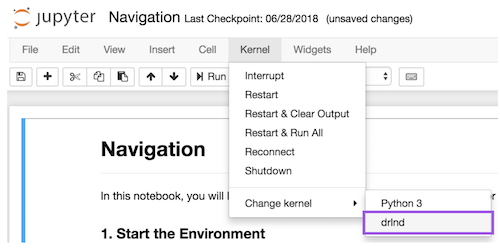

<font size="6">Udacity Deep Reinforcement Learning Nanodegree Program</font>

<div class="alert alert-block alert-info" style="margin-top: 20px">
 <a href="https://www.udacity.com/course/deep-reinforcement-learning-nanodegree--nd893"></a>
</div>

This repository contains the solution of the first project of the [Udacity Deep Reinforcement Learning Nanodegree Program](https://www.udacity.com/course/deep-reinforcement-learning-nanodegree--nd893) from [Christian Motschenbacher](https://gh.linkedin.com/in/christian-motschenbacher-7a660b123)


# Table of Contents

<div class="alert alert-block alert-info" style="margin-top: 20px">
<li><a href="#ref0">Author, Project and Environment description </a></li>
<li><a href="#ref3">Getting Started and Dependencies </a></li>
<li><a href="#ref7">Instructions how to run the code </a></li>
</div>

<hr>

# Author, Project and Environment description
## Author  

**Name: [Christian Motschenbacher](https://gh.linkedin.com/in/christian-motschenbacher-7a660b123)**  

**Date: 01/2019**  

**Project: Udacity Deep Reinforcement Learning Nanodegree Program: Project 1 Navigation (Banana)**  
**This file contains the project environment details such as the state and action space and when the environment is considered soved. It also contains how to get started by installing the dependencies and or download the necessary files on the local computer. Furthermore, it describes how to run the code in the repository, to train and test the agent.**


## Project and Environment description

    
<p>The task of this project was to to train an agent, who navigates in a large environment, collect as many yellow bananas while avoiding blue bananas. The following video shows how a trained agent is performing this task.</p>


<p>A reward of +1 is provided for collecting a yellow banana, and a reward of -1 is provided for collecting a blue banana.  Thus, the goal of the agent is to collect as many yellow bananas as possible while avoiding blue bananas.  </p>

<p>The state space has 37 dimensions and contains the agent's velocity, along with ray-based perception of objects around the agent's forward direction.  Given this information, the agent has to learn how to best select actions. Four discrete actions are available, corresponding to:</p>

<ul>
<li><strong><code>0</code></strong> - move forward.</li>
<li><strong><code>1</code></strong> - move backward.</li>
<li><strong><code>2</code></strong> - turn left.</li>
<li><strong><code>3</code></strong> - turn right.</li>
</ul>

<p>The task is episodic and in order to solve the environment, the agent must achieve an average score of +13 over 100 consecutive episodes.</p>

<p>The notebook for the training and testing "Navigation_solution_training_testing.ipynb" in this folder contains the chapter "Examine the State and Action Spaces", where you can find an example of the state space and action space as well more detailed information about the environment and project.</p>

<p> For the solution of this task it has been used the banana environment from Unity-Technologies, the Python programming language as well the libraries NumPy, PyTorch and others.</p>


<hr>

# Getting Started and Dependencies
This DRL project use three main software components.
Those components are Python, Udacity DRL course dependencies and as well the Unity-Technologies/ml-agents dependencies. The installations of those elements are described in the following subsections.

## Python
In order to set up the python environment run the following code and follow the instructions below.

**Create (and activate) a new environment with Python 3.6 including the anaconda packages.**  
The following code state how to install python on Linux, Mac or Windows.
In order to install python on your target system you must write or copy paste the following command into the command line of your system.
The three code commands in the following code sections do the following.
1. Install python and the anaconda packages into the new environment with the name drlnd.
2. Activate the new created environment
3. Deactivate the environment

	- __Linux__ or __Mac__: 
	```bash
	conda create --name drlnd python=3.6 anaconda  
	source activate drlnd  
    conda deactivate  
	```
	- __Windows__:   
	```bash
	conda create --name drlnd python=3.6 anaconda  
	activate drlnd  
    deactivate  
	```

**Note: Activation and deactivation of the environment.**  
Command (... activate drlnd): This command needs to be executed before any additional python library will be installed into this environment.  
Command (... deactivate): This command needs to be executed before the user will work with another environment.
  
For the setup of this project once the first command has been executed the environment can be activated and be activated until all dependencies have been installed. 

**Download this repository**  
Before you continue with the next dependencies download this repository onto your local computer, in order to continue with the following sections.

## Udacity DRL course  
For easier setup of this project the Udacity DRL course dependencies has been extracted from the repository [deep-reinforcement-learning](https://github.com/udacity/deep-reinforcement-learning) and copied into this repository. Therefore, the user can navigate into the folder **"./Installation/DRL_Environment/python"** of this downloaded repository and perform the command ```pip install . ``` in the command line on the local PC to install the dependencies. More information about the installation if needed can be found at the above linked Udacity repository.

## Unity-Technologies/ml-agents
For easier setup of this project the Unity-Technologies/ml-agents dependencies has been extracted from the repository [Unity-Technologies/ml-agents](https://github.com/Unity-Technologies/ml-agents) and copied into this repository. Therefore, the user can navigate into the folder **"./Installation/Unity_Technologies_ml_agents/ml-agents/"** of this downloaded repository and perform the command ```pip install -e . ``` in the command line on the local PC to install the dependencies. More information about the installation if needed can be found at the above linked Unity-Technologies/ml-agents repository.

## Unity-Technologies Environment
For this project, you will **not** need to install Unity - this is because the environments for the different operating systems have already been build for you and you can download it from the links below. You need only select the environment that matches your operating system:

<ul>
<li>Linux: <a target="_blank" href="https://s3-us-west-1.amazonaws.com/udacity-drlnd/P1/Banana/Banana_Linux.zip">click here</a></li>
<li>Mac OSX: <a target="_blank" href="https://s3-us-west-1.amazonaws.com/udacity-drlnd/P1/Banana/Banana.app.zip">click here</a></li>
<li>Windows (32-bit): <a target="_blank" href="https://s3-us-west-1.amazonaws.com/udacity-drlnd/P1/Banana/Banana_Windows_x86.zip">click here</a></li>
<li>Windows (64-bit): <a target="_blank" href="https://s3-us-west-1.amazonaws.com/udacity-drlnd/P1/Banana/Banana_Windows_x86_64.zip">click here</a></li>
</ul>

Then, place the file in the `"./Navigation_notebook_resources/Environment/"` folder of this downloaded GitHub repository and unzip (or decompress) the file.

<p>(<em>For Windows users</em>) Check out <a target="_blank" href="https://support.microsoft.com/en-us/help/827218/how-to-determine-whether-a-computer-is-running-a-32-bit-version-or-64">this link</a> if you need help with determining if your computer is running a 32-bit version or 64-bit version of the Windows operating system.</p>


## Create an [IPython kernel](http://ipython.readthedocs.io/en/stable/install/kernel_install.html) for the `drlnd` environment.  
Run the following code in your command line of your computer to create an **IPython kernel** for your notebook.
```bash
python -m ipykernel install --user --name drlnd --display-name "drlnd"
```

## Before running code in a notebook, change the kernel to match the `drlnd` environment by using the drop-down `Kernel` menu.  



<hr>

# Instructions how to run the code
Once you have installed the previous dependencies you can continue with the following instruction on how to run the code.

## Run the code in training and test mode

### Notebook with training and testing code
The notebook **Navigation_solution_training_testing.ipynb**, which is in the **root folder of this repository**, contains the testing and training code of the agent in the environment. The fist part explains and shows the performance (testing) of an untrained agent, the middle part of this file explains how to train the agent and the bottom part of this file explains and shows the performance (testing) of an trained agent. It is not required to run the whole notebook from the beginning in order to run the testing section, because the training weights file of the neural network (NN) model has been stored in the folder **./Navigation_notebook_resources/Model_weights/**. This means for instance that the user can start this notebook, run the code cells "load libraries", "create environment", "create agent instance" and then the user can run the testing code in the end of the notebook. Otherwise the notebook is well documented, easy to follow and self-explanatory.   

#### DQN agent class
The **"agent class"** is in the file **dqn_agent.py**, which is in the **root folder of this repository**, contains DQN agent class, with all the elements of the DQN algorithm excluding the NN models, which are in the file **model.py** of the same folder. This solution implementation evaluated more DQN NN models, which can be selected in the file **dqn_agent.py** by uncommenting the desired model and commenting the other models in the beginning of the file **dqn_agent.py**. The code in the file is well documented, easy to follow and self-explanatory.   

#### NN model
The **"fully connected NN model classes"** are in the file **model.py**, which is in the **root folder of this repository**, containing the different fully connected NN model classes, with all the elements of the NN algorithm. The code in the file is well documented, easy to follow and self-explanatory.   

## Resources and references
Further resources and references regarding this project and DQN can be found in the following links.

<ul>
<li><p>Riedmiller, Martin. "Neural fitted Q iteration–first experiences with a data efficient neural reinforcement learning method." European Conference on Machine Learning. Springer, Berlin, Heidelberg, 2005.
<a target="_blank" href="http://ml.informatik.uni-freiburg.de/former/_media/publications/rieecml05.pdf">http://ml.informatik.uni-freiburg.de/former/_media/publications/rieecml05.pdf</a></p>
</li>
<li><p>Mnih, Volodymyr, et al. "Human-level control through deep reinforcement learning." Nature518.7540 (2015): 529.
<a target="_blank" href="http://www.davidqiu.com:8888/research/nature14236.pdf">http://www.davidqiu.com:8888/research/nature14236.pdf</a> </p>
</li>
<li><p>Hado van Hasselt, Arthur Guez, David Silver "Deep Reinforcement Learning with Double Q-learning" arXiv.
<a target="_blank" href="https://arxiv.org/abs/1509.06461">https://arxiv.org/abs/1509.06461</a> </p>
</li>
<li><p>Tom Schaul, John Quan, Ioannis Antonoglou, David Silver "Prioritized Experience Replay" arXiv.
<a target="_blank" href="https://arxiv.org/abs/1511.05952">https://arxiv.org/abs/1511.05952</a> </p>
</li>
<li><p>Ziyu Wang, Tom Schaul, Matteo Hessel, Hado van Hasselt, Marc Lanctot, Nando de Freitas "Dueling Network Architectures for Deep Reinforcement Learning" arXiv.
<a target="_blank" href="https://arxiv.org/abs/1511.06581">https://arxiv.org/abs/1511.06581</a> </p>
</li>
<li><p>Volodymyr Mnih, Adrià Puigdomènech Badia, Mehdi Mirza, Alex Graves, Timothy P. Lillicrap, Tim Harley, David Silver, Koray Kavukcuoglu "Asynchronous Methods for Deep Reinforcement Learning" arXiv.
<a target="_blank" href="https://arxiv.org/abs/1602.01783">https://arxiv.org/abs/1602.01783</a> </p>
</li>
<li><p>Marc G. Bellemare, Will Dabney, Rémi Munos "A Distributional Perspective on Reinforcement Learning" arXiv.
<a target="_blank" href="https://arxiv.org/abs/1707.06887">https://arxiv.org/abs/1707.06887</a> </p>
</li>
<li><p>Meire Fortunato, Mohammad Gheshlaghi Azar, Bilal Piot, Jacob Menick, Ian Osband, Alex Graves, Vlad Mnih, Remi Munos, Demis Hassabis, Olivier Pietquin, Charles Blundell, Shane Legg "Noisy Networks for Exploration" arXiv.
<a target="_blank" href="https://arxiv.org/abs/1706.10295">https://arxiv.org/abs/1706.10295</a> </p>
</li>
<li><p>Matteo Hessel, Joseph Modayil, Hado van Hasselt, Tom Schaul, Georg Ostrovski, Will Dabney, Dan Horgan, Bilal Piot, Mohammad Azar, David Silver "Rainbow: Combining Improvements in Deep Reinforcement Learning" arXiv.
<a target="_blank" href="https://arxiv.org/abs/1511.06581">https://arxiv.org/abs/1511.06581</a> </p>
</li>
</ul>


<hr>
